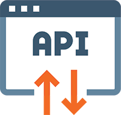

Looma documentation
=================================

Looma is the ultimate hub to connect 433Mhz devices to you homeautomation hub.
You can either control devices or create virtual remotes and get some data information from various sensors (e.g. Weather station temperature sensors).
With this documentation, you'll learn how to install your Looma device by connecting it to you local network and configure supported devices.
Looma can also easily be connected to a MQTT server.

==================  ================== ==================
|Get Started|_      |Using Looma|_     |Ring Reference|_ 
------------------  ------------------ ------------------
`Get Started`_      `Using Looma`_     `Ring Reference`_    
------------------  ------------------ ------------------
|API Reference|_    |Support|_         
------------------  ------------------ ------------------
`API Reference`_    `Support`_         
==================  ================== ==================

.. _Get Started: get-started/index.html

.. _Using Looma: using-looma/index.html

.. _Ring Reference: colored-ring/index.html

.. _API Reference: api-reference/index.html

.. _Support: support/index.html

.. toctree::
   :maxdepth: 2
   :caption: Contents:
   
   get-started/index.rst
   using-looma/index.rst
   colored-ring/index.rst
   api-reference//index.rst
   support//index.rst

